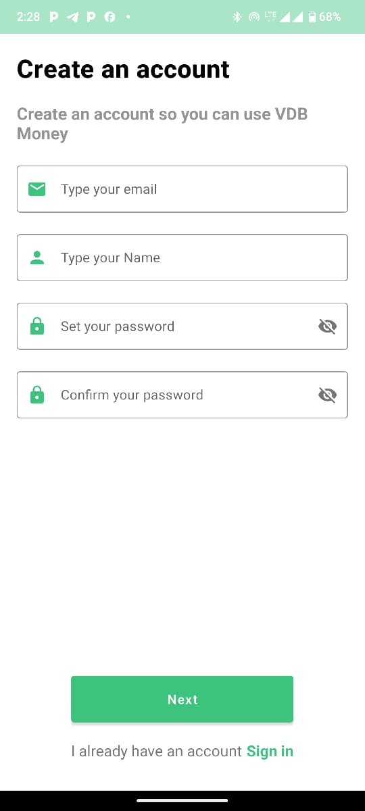

# Project Overview
The Fintech Transfer App is built to showcase fundamental skills in Android development, focusing on user authentication, data management, and UI/UX design. The app uses mock data to simulate account management and transfers, allowing users to log in, view accounts, perform transactions, and see past transfers.

# Architecture: MVVM (Model-View-ViewModel)
The application follows the MVVM architecture to ensure separation of concerns and maintain a clean code structure:

# Architecture: MVVM (Model-View-ViewModel)

The application follows the MVVM architecture to ensure separation of concerns and maintain a clean code structure:

- **Model**: Represents the data layer, including the Room database and data classes. The `Model` manages the local transaction history and mock account data.
- **View**: Consists of the UI components such as `Activity`, `Fragment`, `RecyclerView`, and XML layouts. The `View` displays the data and interacts with the user.
- **ViewModel**: Acts as a bridge between the `Model` and the `View`. It manages UI-related data and holds instances of `LiveData` for observing data changes. The `ViewModel` retrieves data from the `Model` and prepares it for the `View`.

## Libraries Used

- **Firebase Authentication**: For user login and authentication.
- **RecyclerView**: To display lists of accounts and transaction history.
- **Room**: For local database management of transaction history.
- **LiveData**: To observe changes in data and update the UI automatically.
- **ViewModel**: For managing UI-related data lifecycle-consciously.
- **view Binding**: Used to bind the views to the layout
- **Material design**: Used Modern Material design layouts
- **Hilts**: Used for dependency Injection

<h2 align="left">ScreenShots</h2>
<h4 align="start">





<br>

## Getting Started

1. **Clone the repository**  
   ```bash
   git clone https://github.com/emmanueldav/fintech.git
2. Create an account or log in using this:
   ```
    email = iykeemmanuel987@gmail.com. Password:123456789

## Author
Emmanuel Iyke

## License
This project is licensed under the Apache License 2.0 - See: http://www.apache.org/licenses/LICENSE-2.0.txt


